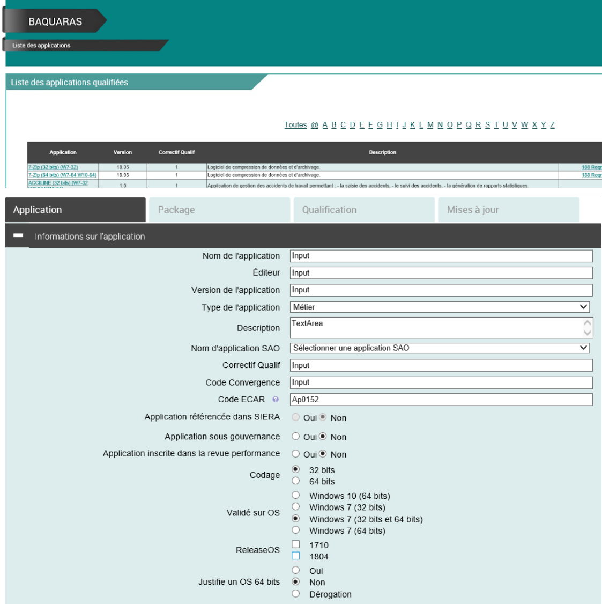

# Baquaras
https://github.com/Sayen-Raigin/PowerShell/blob/master/Ressources/Script/BaquarasAuto.ps1

 

## Script permettant d'alimenter automatiquement l'entrée d'une nouvelle application dans le référencement applicatif de la RATP.

 

 

Le script n'a pas été finalisé complétement ! (version béta)