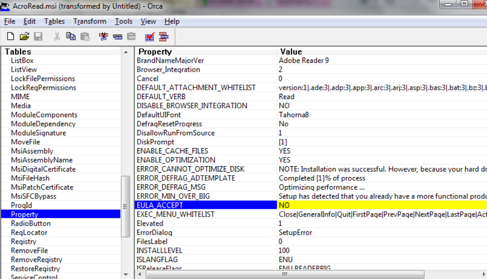

# Get-MSIProperty
 
https://github.com/Sayen-Raigin/PowerShell/blob/master/Ressources/Script/Get-MSIProperty.ps1

## Petite fonction permettant de récupérer les propriétés d'un MSI

 

Source d'aide : 
Exemple d'un qui m'a permis de comprendre certaines méthodes
https://www.scconfigmgr.com/2014/08/22/how-to-get-msi-file-information-with-powershell/