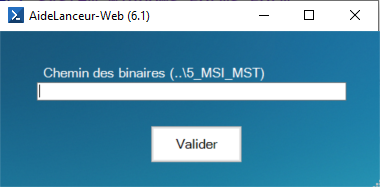

# PS et Windows Forms
 
https://github.com/Sayen-Raigin/PowerShell/blob/master/Ressources/Script/AideLanceur-Web

## Outil permettant d'adapter un soft appelé Lanceur (générateur de script PowerShell) en fonction des packages Web de la RATP.

 

