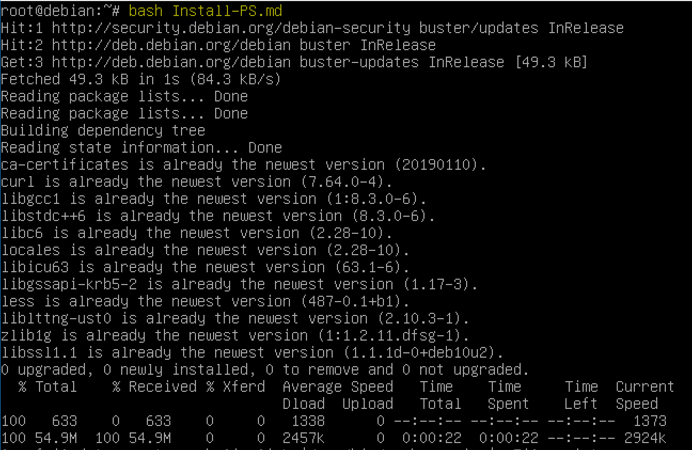

# Script Bash d'installation de PowerShell sur Debian 10

#Source : https://docs.microsoft.com/fr-fr/powershell/scripting/install/installing-powershell-core-on-linux?view=powershell-6#debian-10

#!/bin/bash
apt-get update
apt-get install -y \
       less \
       locales \
       ca-certificates \
       libicu63 \
       libssl1.1 \
       libc6 \
       libgcc1 \
       libgssapi-krb5-2 \
       liblttng-ust0 \
       libstdc++6 \
       zlib1g \
       curl

curl -L https://github.com/PowerShell/PowerShell/releases/download/v7.0.0-preview.4/powershell-7.0.0-preview.4-linux-x64.tar.gz -o /tmp/powershell.tar.gz
mkdir -p /opt/microsoft/powershell/7-preview
tar zxf /tmp/powershell.tar.gz -C /opt/microsoft/powershell/7-preview
chmod +x /opt/microsoft/powershell/7-preview/pwsh
ln -s /opt/microsoft/powershell/7-preview/pwsh /usr/bin/pwsh-preview
pwsh-preview

# 

