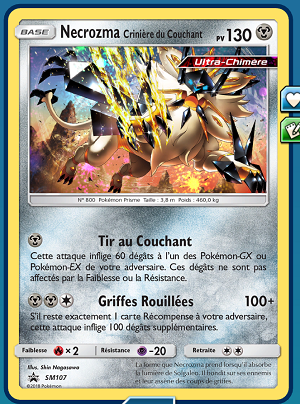
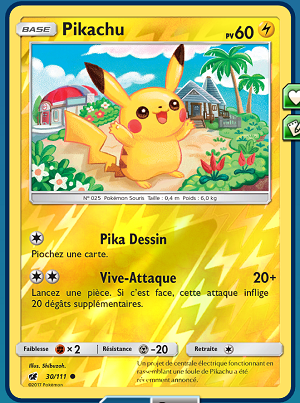
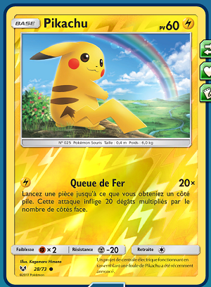

# PROF-CUP

 

Le type de format importe peu, donc vous pouvez adapter votre deck au format illimité.

Il consiste à interdire l'utilisation des cartes turbo, EX et GX.

Le deck doit être composé de : 20 Pokémon - 20 Dresseurs - 20 Énergie.

Il est interdit de jouer plus de 2 fois la même carte qui a le même nom (effet de carte) que sa soit : une carte Pokemon, une carte Dresseur et une carte Énergie spéciale ! 

  

### Même Carte :

  

### Carte différente :

